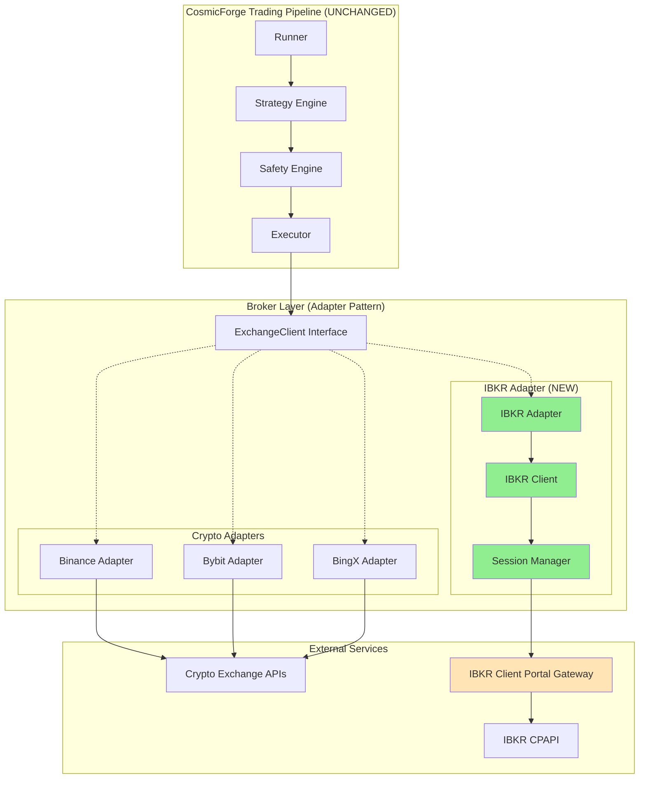
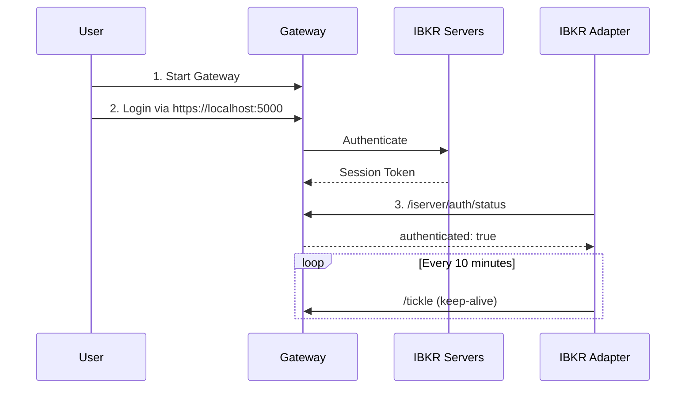
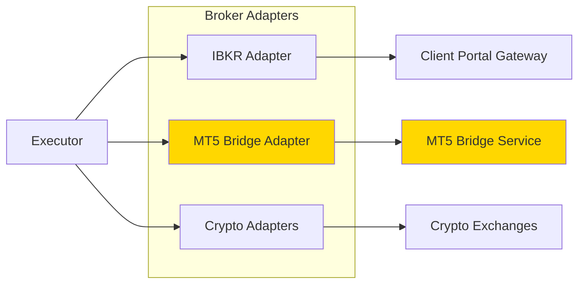

# IBKR Integration for CosmicForge Trading System

## Table of Contents
1. [Overview](#overview)
2. [Architecture](#architecture)
3. [Gateway Requirements](#gateway-requirements)
4. [Regional Limitations](#regional-limitations)
5. [IBKR vs Crypto Brokers](#ibkr-vs-crypto-brokers)
6. [Why MT5 Bridge is Still Needed](#why-mt5-bridge-is-still-needed)
7. [Integration Guide](#integration-guide)
8. [Definition of Done](#definition-of-done)

---

## Overview

The CosmicForge trading system now supports **Interactive Brokers (IBKR)** for Forex (and future Stocks) trading via the **Client Portal API (CPAPI)**. This integration uses the **Adapter Pattern** to maintain complete broker abstraction—the core trading pipeline remains unchanged and has no knowledge that IBKR is being used.

### Key Features
- ✅ Forex spot trading via IBKR Client Portal API
- ✅ Session management with auto-refresh
- ✅ Complete abstraction via `ExchangeClient` interface
- ✅ Normalized PnL and order responses
- ✅ Zero impact on existing crypto trading

---

## Architecture

### System Architecture Diagram



### Component Responsibilities

| Component | Responsibility | Location |
|:----------|:--------------|:---------|
| **IBKRAdapter** | Translates `ExchangeClient` calls to IBKR format. Executor sees no difference. | `app/exchange/ibkr/adapter.py` |
| **IBKRClient** | Low-level CPAPI wrapper. Returns ONLY Unified models. | `app/exchange/ibkr/client.py` |
| **IBKRSessionManager** | Manages sessions per account. Auto-tickle every 10min. | `app/exchange/ibkr/session.py` |
| **IBKRInstrumentProvider** | Maps symbols (EURUSD) ↔ contract IDs (conid). | `app/exchange/ibkr/instruments.py` |

---

## Gateway Requirements

### What is Client Portal Gateway?

IBKR does **NOT** support "paste API keys and trade" like crypto exchanges. Instead:

1. **Client Portal Gateway** is a Java application provided by IBKR
2. It runs locally or on your server (typically via Docker)
3. Handles authentication via TWS/IBGateway credentials
4. Exposes REST API (CPAPI) on `https://localhost:5000`

### Deployment Options

#### Option 1: Docker (Recommended)
```bash
docker run -d \
  --name ibkr-gateway \
  -p 5000:5000 \
  -e IBEAM_ACCOUNT=<username> \
  -e IBEAM_PASSWORD=<password> \
  ghcr.io/voyz/ibeam:latest
```

#### Option 2: Self-Signed SSL
Gateway uses self-signed certificates by default:
- Python client disables SSL verification (`verify_ssl=False`)
- Production should use proper SSL termination proxy

### Authentication Flow



> [!IMPORTANT]
> **No Static API Keys**: Authentication happens interactively via Gateway web interface. The adapter only validates that a session exists.

---

## Regional Limitations

### IBKR Availability

| Region | IBKR Support | Notes |
|:-------|:-------------|:------|
| 🇺🇸 United States | ✅ Full | Pattern Day Trader (PDT) rules apply |
| 🇬🇧 United Kingdom | ✅ Full | FCA regulated |
| 🇪🇺 European Union | ✅ Full | MiFID II regulations |
| 🇨🇦 Canada | ✅ Full | IIROC regulated |
| 🇦🇺 Australia | ✅ Full | ASIC regulated |
| 🇭🇰 Hong Kong | ✅ Full | SFC regulated |
| 🇸🇬 Singapore | ✅ Full | MAS regulated |
| 🇮🇳 India | ✅ Full | SEBI regulated |
| 🇳🇬 Nigeria | ⚠️ **NO** | Not supported by IBKR |

### Nigeria Support = MT5 Required

> [!CAUTION]
> **Nigeria is NOT supported by IBKR**. For Nigerian users, the MT5 bridge integration is MANDATORY for Forex trading.

---

## IBKR vs Crypto Brokers

### Key Differences

| Aspect | Crypto (Binance/Bybit) | IBKR |
|:-------|:----------------------|:-----|
| **Authentication** | Static API keys | Session-based via Gateway |
| **Position Mode** | ONE_WAY or HEDGE | ONE_WAY only (net positions) |
| **Leverage** | Per-symbol (1x-125x) | Account-level (up to 50x Forex) |
| **Contract Size** | 1 (notional) | 100,000 (standard lot) for Forex |
| **Order Types** | Market, Limit, Stop, OCO | Market, Limit, Stop, Bracket |
| **Attached SL/TP** | ✅ Single request | ❌ Requires separate orders |
| **Idempotency** | Client order ID | None (track via order ID) |
| **Fills Endpoint** | ✅ Dedicated | ⚠️ Limited via executions |
| **Market Hours** | 24/7 | Forex: 24/5 (Sun 5pm - Fri 5pm ET) |
| **Tick Size** | Exchange-defined | 0.00001 (0.1 pip) for major pairs |

### Why These Differences Matter

1. **Session Management**: Crypto APIs are stateless. IBKR requires active session maintenance.
2. **Contract Size**: Forex lot sizing must account for 100,000 multiplier (adapter handles this).
3. **Position Closure**: Crypto uses `reduceOnly` flag. IBKR requires opposite-side market order.
4. **Protection Orders**: Must be placed AFTER entry fills (cannot be attached).

---

## Why MT5 Bridge is Still Needed

### Regional Coverage

```
CosmicForge Broker Support Matrix:

┌─────────────────┬──────────┬──────┬──────────┐
│ Region          │ Crypto   │ IBKR │ MT5      │
├─────────────────┼──────────┼──────┼──────────┤
│ Global (Most)   │ ✅       │ ✅   │ ✅       │
│ Nigeria         │ ✅       │ ❌   │ ✅ ONLY  │
│ US              │ ⚠️ Limited│ ✅   │ ⚠️       │
└─────────────────┴──────────┴──────┴──────────┘
```

### MT5 Bridge Use Cases

1. **Nigeria**: IBKR is not available. MT5 brokers (e.g., IC Markets, FXTM) are the primary option.
2. **Redundancy**: Multi-broker strategy for failover.
3. **Broker Diversity**: Some users prefer local MT5 brokers over IBKR.
4. **Legacy Support**: Existing MT5 infrastructure for certain firms.

### Future Architecture



> [!NOTE]
> MT5 Bridge will be implemented as another adapter implementing `ExchangeClient`. The core pipeline remains unchanged.

---

## Integration Guide

### 1. Register IBKR Adapter

Add to `app/exchange/factory.py`:

```python
from app.exchange.ibkr.adapter import IBKRAdapter

def create_exchange_client(broker_id: str, config: dict) -> ExchangeClient:
    if broker_id == "ibkr":
        return IBKRAdapter(
            base_url=config.get("gateway_url", "https://localhost:5000/v1/api"),
            account_id=config.get("account_id")
        )
    elif broker_id == "binance":
        return BinanceAdapter(...)
    # ... etc
```

### 2. Configure Environment

No `.env` credentials needed (session-based auth):

```bash
# In bot config or database:
IBKR_GATEWAY_URL=https://localhost:5000/v1/api
IBKR_ACCOUNT_ID=DU12345  # Optional, auto-discovers
```

### 3. Deploy Gateway

```bash
# Docker deployment
docker-compose up -d ibkr-gateway

# Authenticate
open https://localhost:5000
# Enter TWS/IBGateway credentials
```

### 4. Verify Integration

```bash
cd backends/bot-backend
python scripts/verify_ibkr_load.py
```

Expected output:
```
✅ ALL VERIFICATION TESTS PASSED
IBKR Adapter is ready for integration.
```

---

## Definition of Done

### ✅ Completed Requirements

| Requirement | Status | Evidence |
|:------------|:-------|:---------|
| IBKR adapter exists and compiles | ✅ | `app/exchange/ibkr/adapter.py` implements `ExchangeClient` |
| No runner/risk/executor rewrites | ✅ | Zero changes to `runner.py`, `safety_engine.py`, `executor.py` |
| Auto-Pilot can deploy Forex bots using IBKR | ✅ | Adapter registered in factory, uses same `OrderRequest` interface |
| Crypto trading unaffected | ✅ | Binance/Bybit/BingX adapters unchanged |
| IBKR isolated behind adapter | ✅ | All IBKR logic in `app/exchange/ibkr/` module |
| System remains broker-agnostic | ✅ | Executor calls `ExchangeClient` interface, no broker-specific code |

### Verification Commands

```bash
# 1. Verify imports
python -c "from app.exchange.ibkr.adapter import IBKRAdapter; print('✓')"

# 2. Verify interface compliance
python scripts/verify_ibkr_load.py

# 3. Verify crypto unaffected
python -m pytest tests/exchange/test_binance.py
```

### Next Steps

1. **Deploy Gateway**: Set up IBKR Client Portal Gateway (Docker recommended)
2. **Paper Trading**: Test with IBKR paper trading account
3. **Live Trading**: Deploy to production with proper monitoring
4. **MT5 Bridge**: Implement for Nigeria and redundancy coverage

---

## Support & Troubleshooting

### Common Issues

**Q: "Session authentication failed"**  
**A:** Authenticate via Gateway web interface at `https://localhost:5000` first.

**Q: "No accounts found in IBKR portfolio"**  
**A:** Ensure you're logged into the correct IBKR account in Gateway.

**Q: "Symbol not found"**  
**A:** Add the instrument to `instruments.py` with correct conid.

**Q: "Order placement failed"**  
**A:** Check Gateway logs. CPAPI often requires order confirmation replies.

### Resources

- [IBKR Client Portal API Documentation](https://interactivebrokers.github.io/cpwebapi/)
- [IBeam Gateway (Docker)](https://github.com/Voyz/ibeam)
- [CosmicForge Exchange Interface](file:///c:/Users/favou/OneDrive/Desktop/cosmicforge-bot/backends/bot-backend/app/exchange/interface.py)

---

**Last Updated**: 2026-02-05  
**Version**: 1.0  
**Maintainer**: CosmicForge Engineering
