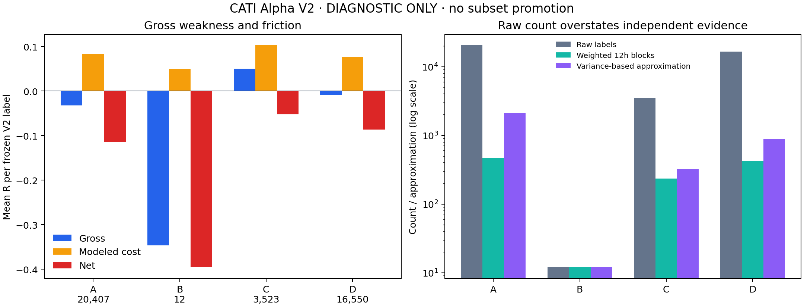

# CATI Alpha root-cause and next edge discovery

All statistics here are **DIAGNOSTIC_ONLY**. V2 remains CLOSED and failed. No discovered subset is promoted. The next mandate is prepared and frozen; **NEXT_RESEARCH_EXECUTED = NO**.

Work was performed directly on `C:\Projects\cosmicforge-bot` main. Starting main and origin/main were clean and equal `c9a50f4da19f1fa5b34c4aaddad40b7f493c4cf2`; fast-forward pull was already up to date. End commit and final live runtime probe are supplied with delivery because a report cannot contain its own commit hash.

**Runtime and product fixes.** Engine identity remains CATI. `/engine-status` derives RUNNING/STOPPED/STALE from the existing canonical preflight, process, matching session, lease, listener PID and heartbeat, including PID reuse rejection. Observe mode requires a running process and blocked CATI entry authority. Entry authority is resolved independently through unchanged account/governance gates. Process liveness is global canonical-runtime liveness, not proof that an arbitrary historical instance is active. CATI-managed identity is explicit. AutoPilot status/pause/resume select only `strategy_id=cati`; non-CATI history is retained and excluded from these controls. Newly created CATI product naming no longer says Master Ensemble.

**Preservation.** No V2 generator, geometry, costs, folds, registry, labels, results or evidence was changed. Section22 policy is unchanged. No library, prediction model, certification or eligibility was produced. The original decompressed labels SHA256 is `65c3aa355b12aad635479b27afb0a6ba113e43e3fe1ab24442bd73fefa42917c`.

**Population economics (mean R).** Labels span 2025-01-12 through 2026-07-11, over 546 active UTC dates. Source prefixes include earlier development warmup; no reserved future prices were queried.

| Mechanism | Raw labels | Gross | Modeled cost | Net | Net 2x costs | Stop % | Timeout % |
|---|---:|---:|---:|---:|---:|---:|---:|
| A relative strength | 20,407 | -0.032447307 | 0.082631546 | -0.115078853 | -0.197710400 | 54.82 | 22.48 |
| B volatility transition | 12 | -0.346722256 | 0.049053819 | -0.395776075 | -0.444829894 | 33.33 | 58.33 |
| C MTF pullback | 3,523 | +0.050511595 | 0.102384193 | -0.051872598 | -0.154256792 | 58.50 | 11.41 |
| D volume-flow proxy | 16,550 | -0.009168694 | 0.076995863 | -0.086164556 | -0.163160419 | 46.98 | 35.18 |
| Combined diagnostic | 40,492 | -0.015808120 | 0.082036739 | -0.097844859 | -0.179881599 | 51.93 | 26.72 |

**Answers A–J.**

A. Gross alpha is absent in A and D; B is negative but has only12 observations and cannot support a broad inference. C has positive gross mean, but insufficient gross economics after costs. Combined gross is −0.015808120R.

B. Friction is the largest arithmetic contributor to combined loss: 0.082036739R of 0.097844859R (~83.84%). C is specifically a COST_TO_R failure under unchanged modeled costs. This is modeled economics, not observed execution.

C. Tight stops are not established as a universal cause. Median structural risk/ATR is A2.653, B4.513, C1.874, D and combined values in diagnostics.json. C stops58.50% of the time, but widening a stop changes R, exposure and target economics; that counterfactual was not tested or authorized.

D. Target geometry frequently fails to realize: combined target rate21.35%, median target room1.886R and median MFE bound0.850R; 78.90% have MFE bound below the target reference. C median target room1.853R/MFE1.036R and70.22% below-target bounds. Terminal-bar censoring prevents an exact full-horizon or intrabar causal conclusion. No target was shortened.

E. Timeouts are not the majority: combined26.72%, A22.48%, C11.41%, D35.20%. B58.33% is only7 of12. Combined timeout gross is positive+0.423245R; C timeout gross+0.713981R. Removing timeouts could remove gross gains, and was not tested.

F. Gross performance is state-dependent. C BTC-range gross+0.100583R still nets−0.004533R; ETH-down gross+0.102395R nets only+0.001070R and−0.100255R at2x costs. These overlapping post-hoc groups do not meet a frozen discovery or promotion standard. Every subgroup, including favorable ones, remains DIAGNOSTIC_ONLY.

G. No monotone signal-frequency decay is established. Combined concurrent-count versus gross Spearman is+0.1055 and monthly-count versus gross is−0.0456; C is+0.0414/+0.4379. Tied frequency values remain together rather than being arbitrarily split. Frequency/state/time composition confounds these associations.

H. Yes, dependence substantially inflates apparent sample size. 76.25% of combined labels share a timestamp with another label;41.92% of adjacent same-instrument label horizons overlap. Actual closed15m pairwise return correlation mean0.5963/median0.6078 across9,180 instrument pairs. C sides align with BTC/ETH24h directions71.93%/73.18%. Raw count is not independent information.

I. Crowding does not explain losses monotonically: highest timestamp crowding group combined gross+0.009591R/net−0.069013R versus lowest−0.033633R/−0.117920R. Positive association is weak and diagnostic. Known-group clustering is measured, but87.69% of labels lack a known static group; semantic sector-loss attribution is unsupported.

J. The data does not establish that15m is inherently too noisy. It establishes failure of these particular15m rules/geometry/costs. C median structural risk1.512% and median modeled cost0.160% consume0.106R. Slower1h execution is a new frozen hypothesis, not a demonstrated fix.

**Distributions and all28 dimensions.** `diagnostics.json` contains mean/std and0/1/10/25/50/75/90/99/100% quantiles for each family and union: gross/cost/net R, stop/target distances, structural-risk percentage and ATR units, target-room/R and executed target/stop ratio, holding-time lower/upper bounds, MFE/MAE terminal bounds, entry/exit excursions, exit-to-target shortfall, modeled price cost, hypothetical entry+exit turnover, RV24h, volume and dispersion. Full side/instrument/group/year/month/UTC session/weekday/volatility/trend/BTC/ETH/volume tables plus dispersion/RV/risk/cost/target-room/frequency deciles are in `diagnostic_subgroups.csv`. No fields or unfavorable groups were silently removed. Timeout exit excursion relative to stop/target is deliberately unavailable; exit-to-target shortfall remains measured. The compressed40492-row diagnostic table is provided for inspection.

| Family | Stop distance median % | Target distance median % | Room median R | Cost median R | Holding upper median min |
|---|---:|---:|---:|---:|---:|
| A relative strength | 1.96775 | 4.05344 | 1.87291 | 0.08110 | 285.00000 |
| B volatility transition | 4.18542 | 6.36224 | 1.52361 | 0.03799 | 720.00000 |
| C MTF pullback | 1.51369 | 3.14930 | 1.85284 | 0.10574 | 165.00000 |
| D volume-flow proxy | 2.14980 | 4.49798 | 1.90830 | 0.07432 | 465.00000 |
| Combined diagnostic | 1.99384 | 4.14462 | 1.88594 | 0.08016 | 330.00000 |

**C economics.** Median modeled round-trip cost0.160094238% of price (16.0094bps); median structural risk1.511553343%; median cost/R0.105737433. Mean gross+0.050511595R versus mean cost0.102384193R. Arithmetic break-even mean cost is0.050511595R, or49.3353% of the existing cost schedule. Uniform scaling would correspond to a hypothetical median price cost0.078983045%; this is a diagnostic counterfactual, never a new cost policy. Gross needs more than an additional0.051872598R for positive net at normal costs, or0.154256792R at2x costs (absolute gross above0.102384193R/0.204768387R respectively). Costs were not lowered.

**Effective information.** Two approximations are reported because there is no unique certified independent count. Kish units = n²/sum(calendar12h-block count²); blocks may share a horizon across boundaries and are not proven independent. The variance proxy = individual net-R variance divided by UTC-day HAC mean variance, capped at raw n, with7 daily lags. Their disagreement is a methodological limit, not an opportunity to select the larger number. Counts below are descriptive and cannot satisfy admission.

| Family | Raw | Unique timestamps | Weighted12h block units |7day HAC variance proxy |
|---|---:|---:|---:|---:|
| A relative strength | 20,407 | 11,850 | 473.44 | 2092.59 |
| B volatility transition | 12 | 12 | 12.00 | 12.00 |
| C MTF pullback | 3,523 | 2,133 | 236.98 | 323.66 |
| D volume-flow proxy | 16,550 | 6,681 | 420.31 | 881.94 |
| Combined diagnostic | 40,492 | 16,571 | 558.57 | 2041.46 |

**Actual data inventory.** All repository SQLite files were inventoried, including legacy copies, backups, empty stubs and replay databases. Noncanonical copies are not new independent evidence. Exact per-symbol source/rows/bounds/quality are in `data_inventory.json`, `additional_inventory.json`, `supplemental_inventory.json` and `native_1m_field_receipt.json`. Historical prices were bounded to close strictly before1783876499999 (2026-07-12T17:14:59.999000+00:00); actual maximum closed15m/hourly feature timestamp is1783875599999. The integer bound is authoritative; human dates below are converted from stored timestamps.

| Stored source | Resolution/field | Bounded rows | Symbols | Availability/quality/use |
|---|---|---:|---:|---|
| crypto_deep_binance market_candles / binance_fapi_klines | Native1m |77,037,173 |35 | HISTORICAL_AVAILABLE; zero invalid OHLCV; zero duplicate/interior missing slots within each observed first/last span; listing bounds in inventory_quality_summary.json, reconstructed historical availability |
| Same source | Derived/native store5m |15,407,405 |35 | HISTORICAL_AVAILABLE; all rows have quote_volume/trades; zero timestamp defects and invalid OHLCV; derived_from identity is recorded |
| Canonical historical_candles / binance | Native15m |8,587,040 |136 | HISTORICAL_AVAILABLE; source prefix hashes match V2; zero invalid OHLCV; complete aligned4/16-bar groups permit causal1h/4h derivation |
| Canonical historical_candles / binance | Stored1h |21,600 |5 | HISTORICAL_AVAILABLE; BNB,BTC,ETH,SOL,XRP;2025-12-12 through2026-06-10; distinct older source window, do not merge histories blindly |
| Deep market_feature_observations | Settled funding |173,875 |35 | HISTORICAL_AVAILABLE; settlement time, not knowledge of upcoming funding; use previous settlement only |
| Same | Hourly mark / index / basis |1,282,709 /1,282,732 /1,282,679 |35 | HISTORICAL_AVAILABLE; closed-hour mark/index, exact aligned derived basis, missing joins reject |
| Repository1m/5m/15m/1h/4h BTC/ETH manifests | Declarative2y/120d coverage | See manifest |2 | Metadata exists; standalone declared derived series were not found as canonical stored rows. Manifest is not proof of current physical completeness; post-cutoff portions excluded |
| FX Dukascopy fx_reference_quotes | Bid/ask1m and1h | See per-pair JSON |49 observed at inventory | HISTORICAL_AVAILABLE reference quotes; acquisition incomplete, no freeze;50-pair manifest is intended universe |
| Canonical event snapshots/reactions | Event observations |2,170 /100 | See existing source tables | Historical event context exists; spread/depth fields all null; after-event values are outcomes and not causal inputs |
| Canonical trade_fills | Execution-history records |17,558 | Historical records | Fee populated16,503; slippage17,060; funding-fee0; estimated/vintage provenance incomplete, not a clean historical execution-cost panel |

Deep-source earliest actual native candle is2021-09-24; symbol-specific listing starts vary through2024-04-11. No continuous panel is inferred merely from min/max dates. Historical OI/spread/depth/liquidations have explicit UNAVAILABLE markers for35 assets in the permitted development prefix. Raw historical aggressor trades/book snapshots are not present in inspected source tables; candle trade counts and volume are available and must not be mistaken for signed trade flow.1m quote-volume/trade field presence is sampled; full5m populated counts are verified. Stored4h is not present in inspected physical tables; exact complete resampling is possible. Duplicate copies and synthetic/replay rows remain lineage-limited.

**Forward observe.** A single bounded asynchronous worker is scheduled only by the canonical current lease-owning runtime, every5minutes, for BTCUSDT/ETHUSDT public Binance USD-M reference data. It never instantiates an execution client or submits orders. It stores receipt time as availability, raw book/trade payloads, source endpoint and explicit reference-only provenance. Fresh initial capture wrote34 observations:30 AVAILABLE and4 liquidation UNAVAILABLE. Public spread/bid/ask, raw top-of-book and20-level quote depth, imbalance,1000USDT book-walk round-trip price proxy, bounded aggressor buy quote fraction/quote volume, mark/index/basis, last funding/next funding time and OI are FORWARD_OBSERVE_ONLY. Book proxy excludes fees, funding and latency and is not realized broker execution. Failed/future/nonfinite/malformed observations are UNAVAILABLE rather than zero. Liquidation stream is not configured; missing historical OI/flow/book/liquidations cannot be backfilled from these observations. The collector catches failures so CATI analysis continues. Official endpoint documentation is linked in source_receipt.json.

**Next mandate.** Registry `CATI_NEXT_EDGE_DISCOVERY_MANDATE_003` freezes three families: residual momentum with strongest concurrent portfolio selection; dispersion-break residual relative-value convergence; and settled-funding/basis relative carry across the actually stored35-asset feature universe. All use1h decision timestamps and closed inputs. They specify causal inputs, exact universe, entry/exit geometry, cost policy, minimum evidence, five calendar folds, full-horizon purge, economic gates, attempt/run budget, exact source/code hashes and paired-leg capability blockers. No A/B/C/D subgroup becomes a strategy. No new-family outcome, label, forecast or prediction model was evaluated. Only one future evaluation run is registered; no adaptive replacement. Backfilled source-time causality requires audit before evaluation, and insufficient selected-portfolio support must remain blocked. Market-neutral or paired structures require broker/risk/protection validation before governed use; reference index is not assumed tradable. Full original Section22 governance remains necessary.

**FX.** At12:21UTC acquisition plan showed1,767 periods remaining, down from2,837 earlier in this work. The existing single actual writer and completion watcher were retained. Completion triggers existing sequential5m/15m/4h derivation, QA, scale checks and strict gap classification; freeze requires pass. No duplicate writer was started and no FX result was prematurely frozen. Final delivery reports the later current snapshot.

**Validation.** Focused regression run53 passed, cycle/status/observe follow-up29 passed, frontend TypeScript/Vite build passed. Initial full run1405 passed with one stale-source inspection mismatch caused by editing while tests were loaded; isolated source-inspection and closure tests subsequently passed. Final full CATI/runtime regressions passed **1412 tests**, with8 existing LightGBM metadata warnings, in453.03seconds after all final runtime sources were stable. Scientific figure was rendered and inspected; notebook source identity/uniqueness/bound checks are executable using only published artifacts. Existing warnings concern LightGBM feature-name metadata and frontend bundle/browsers data, not relaxed gates.

**Governance and remaining blocker.** GOVERNANCE=M0; CATI_RUNTIME=ACTIVE; CATI_MODE=OBSERVE; CATI_ENTRY_AUTHORITY=BLOCKED. HOLDOUT_OPENED=NO; HOLDOUT_INSPECTED=NO; HOLDOUT_QUERY_COUNT=0. No demo/live entry, broker order validation, prediction-model training, cost reduction or threshold change. The first blocker is absence of a distinct, prospectively registered edge that survives costs and independent-evidence/governance requirements. Next action is an explicitly separate evaluation of the frozen mandate after input/paired-execution evidence checks, while forward observation and the existing FX completion pipeline continue.

Artifacts: [all numerical diagnostics](diagnostics.json), [all subgroup tables](diagnostic_subgroups.csv), [40492 diagnostic rows](diagnostic_rows.csv.gz), [companion notebook](alpha_root_cause.ipynb), [source receipt](source_receipt.json), [frozen next registry](next_edge_registry.json).

Final pre-commit FX snapshot: 2026-10-03T12:50:05.217282+00:00; FX_STATUS=ACQUISITION_IN_PROGRESS; FX_REMAINING=1715; FX_FROZEN=NO. The writer continues, so this is a timestamped observation.

Runtime-status receipt directly exercised the API handler with the canonical DB and owned active record. It reported CATI/RUNNING/OBSERVE/BLOCKED/M0; the active historical strategy record correctly has cati_managed_instance=false and is excluded from CATI AutoPilot controls. Final post-restart proof is provided at delivery.
