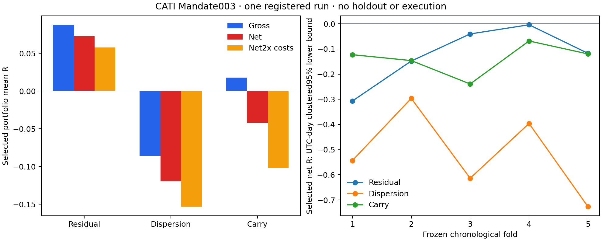

# CATI Mandate 003 consolidated result

All three frozen families failed the economic gate. Model training, library building and certification were not performed. No Mandate 004 was created. CATI continues observing with entry blocked at M0; existing forward collection and FX acquisition continue.

Statistics are mean R per selected position/basket, not cumulative P&L. Days are distinct UTC decision days; profit rate is net R > 0. [Cost stresses and sums](cost_stress_and_sums.csv) supplies totals and 1.5x-cost net. Raw overlapping counterfactual labels are diagnostic, never portfolio trades.

START_COMMIT = e4d3cd16e19a16eb385a1d96e9d7dabd838f07df. Baseline was clean, equal to origin/main, with ff-only pull current. Pre-outcome source commit = 8ca044670c4481ccbeb2efc112afd17e1ad288f9. END_COMMIT, REMOTE_MAIN_PUSHED and WORKTREE_CLEAN are resolved in final delivery using the results commit containing this report.
REGISTRY_ID = CATI_NEXT_EDGE_DISCOVERY_MANDATE_003. REGISTRY_HASH (SHA-256) = f3cac76976590fb59ae9f83252092dc484cf89e59b3880945288bc92458ce36f. EVALUATION_RUNS = 1. Exactly three major hypotheses, all reported separately; no second run, replacements, threshold changes, cost reductions, universe revision or post-result combination.
Original registry bytes remain unchanged, including its prepared status. The explicit user brief authorized this run separately. Frozen source universe contains 136 assets; its registered tradable universe contains 134 (BTC/ETH are factors). Carry uses the frozen 35-asset feature universe.

Provenance exception: evaluator/audit/test/report sources were committed before outcomes, but the hashed local input cache was untracked. A pre-run clean assertion detected that cache and failed before writing its proposed receipt; the single run subsequently started with unchanged committed sources and verified all cache hashes. A specific gitignore exclusion was added after completion. This is not claimed as a clean pre-run tree; the clean baseline and final delivery are separate checks. [Execution provenance](execution_provenance.json) preserves the exception.

SOURCE_CAUSALITY_AUDIT = PASS before outcomes. Closed native bars only; exact complete aligned four-bar hourly groups; gaps invalidate trailing windows; 672 complete trailing hourly returns and full-rank factor fit using available samples. Signal funding uses three completed settlements strictly before decision, subject to frozen age limits. Mark/index/basis require exact fresh timestamp joins; missing joins skip. Full-horizon fold/development purge applies even to early exits.
Backfilled source-time causality is structurally audited, but contemporaneous ingestion vintage is not independently proven. Settled funding cashflows use a latest causal hourly mark notional proxy, not broker payment receipts. Forward-only records were never historical inputs.

PAIRED_EXECUTION_RESEARCH_CAPABLE = NO. Both paired families carry RUNTIME_CAPABILITY_BLOCKED = YES. Research diagnostics are permitted by the frozen registry. Existing single-instrument primitives do not prove two-leg synchronized intent, joint sizing, exposure/margin aggregation, basket ownership, coordinated leg protection, matched partial fills, one-leg failure recovery, coupled unknown-outcome reconciliation, paired unwind, or no naked-leg fallback. All eleven paired checks are unsupported; no broker orders were sent. See [capability audit](paired_capability_audit.json).

| Family | Raw candidates | Counterfactual labels | Selected trades | Days | Gross R | Cost R | Net R | 2x-cost net R | Gate |
| --- | --- | --- | --- | --- | --- | --- | --- | --- | --- |
| RESIDUAL_MOMENTUM_PORTFOLIO_TOP1 | 86278 | 86278 | 326 | 319 | 0.087762 | 0.015010 | 0.072752 | 0.057743 | FAIL |
| DISPERSION_BREAK_RESIDUAL_RELATIVE_VALUE | 792 | 792 | 103 | 78 | -0.085849 | 0.033689 | -0.119538 | -0.153227 | FAIL |
| SETTLED_FUNDING_BASIS_RELATIVE_CARRY | 3220 | 3201 | 518 | 303 | 0.017588 | 0.059720 | -0.042132 | -0.101851 | FAIL |

## RESIDUAL_MOMENTUM_PORTFOLIO_TOP1

Positive pooled net and 2x-cost net cannot rescue fold 1 negative gross or any of the five negative confidence bounds. There are 13,117 valid ranked concurrent opportunities; 12,791 overlap attempts are rejected, leaving 326 portfolio trades. The other 73,161 concurrent counterfactual labels are never trades. TIMEOUT occurs in 283/326 trades, median holding 48 hours.

| Fold | Selected | Days | Gross R | Cost R | Net R | 2x-cost net R | Net clustered 95% LCB | Profit rate | TARGET | STOP | CONVERGENCE | TIMEOUT |
| --- | --- | --- | --- | --- | --- | --- | --- | --- | --- | --- | --- | --- |
| 1 | 55 | 52 | -0.093242 | 0.013960 | -0.107202 | -0.121163 | -0.306946 | 0.327273 | 1 | 8 | 0 | 46 |
| 2 | 69 | 68 | 0.023734 | 0.015694 | 0.008039 | -0.007655 | -0.148076 | 0.521739 | 2 | 7 | 0 | 60 |
| 3 | 67 | 66 | 0.187778 | 0.015339 | 0.172438 | 0.157099 | -0.040430 | 0.507463 | 5 | 4 | 0 | 58 |
| 4 | 67 | 67 | 0.221628 | 0.016133 | 0.205495 | 0.189363 | -0.004023 | 0.567164 | 5 | 5 | 0 | 57 |
| 5 | 68 | 66 | 0.068689 | 0.013732 | 0.054957 | 0.041225 | -0.117395 | 0.485294 | 2 | 4 | 0 | 62 |

Pooled exits = {"TIMEOUT": 283, "STOP": 28, "TARGET": 15}; net profit rate = 0.487730.
ECONOMIC_GATE = FAIL. Exact failing clauses: FOLD_1_GROSS_NOT_POSITIVE, FOLD_1_NET_DAY_CLUSTERED_LCB_NOT_POSITIVE, FOLD_2_NET_DAY_CLUSTERED_LCB_NOT_POSITIVE, FOLD_3_NET_DAY_CLUSTERED_LCB_NOT_POSITIVE, FOLD_4_NET_DAY_CLUSTERED_LCB_NOT_POSITIVE, FOLD_5_NET_DAY_CLUSTERED_LCB_NOT_POSITIVE.
MINIMUM_EVIDENCE_GATE = PASS. Raw evidence minima satisfied; selected model-support admission is separate and not claimed.

| Raw counterfactual population | Count | Days | Gross R | Cost R | Net R | 2x-cost net R |
| --- | --- | --- | --- | --- | --- | --- |
| Pooled | 86278 | 623 | 0.030901 | 0.020576 | 0.010324 | -0.010252 |
| Fold 1 | 16314 | 104 | 0.101471 | 0.016356 | 0.085114 | 0.068758 |
| Fold 2 | 18384 | 130 | 0.085239 | 0.020762 | 0.064476 | 0.043714 |
| Fold 3 | 15676 | 130 | -0.141745 | 0.021863 | -0.163608 | -0.185471 |
| Fold 4 | 17828 | 129 | 0.050414 | 0.020915 | 0.029499 | 0.008584 |
| Fold 5 | 18076 | 130 | 0.042424 | 0.022746 | 0.019678 | -0.003069 |

Source/execution skips = {"score_eligible_signals": 89172, "raw_candidates": 86278, "INVALID_GEOMETRY": 1840, "full_horizon_purged_signals": 1054}.

## DISPERSION_BREAK_RESIDUAL_RELATIVE_VALUE

Convergence exits dominate, but pooled selected gross is negative before costs. Folds 1, 3 and 5 lose gross, every fold fails its confidence bound, and pooled 2x-cost net is negative. Sparse raw evidence independently fails all fold and pooled minima.

| Fold | Selected | Days | Gross R | Cost R | Net R | 2x-cost net R | Net clustered 95% LCB | Profit rate | TARGET | STOP | CONVERGENCE | TIMEOUT |
| --- | --- | --- | --- | --- | --- | --- | --- | --- | --- | --- | --- | --- |
| 1 | 23 | 16 | -0.231291 | 0.036696 | -0.267988 | -0.304684 | -0.543426 | 0.391304 | 0 | 9 | 12 | 2 |
| 2 | 12 | 10 | 0.163854 | 0.031953 | 0.131901 | 0.099948 | -0.296377 | 0.750000 | 0 | 3 | 9 | 0 |
| 3 | 19 | 14 | -0.028458 | 0.037962 | -0.066420 | -0.104382 | -0.613583 | 0.526316 | 1 | 8 | 10 | 0 |
| 4 | 26 | 20 | 0.053233 | 0.029968 | 0.023264 | -0.006704 | -0.396003 | 0.615385 | 0 | 6 | 18 | 2 |
| 5 | 23 | 18 | -0.275320 | 0.032262 | -0.307582 | -0.339844 | -0.726481 | 0.521739 | 0 | 9 | 13 | 1 |

Pooled exits = {"STOP": 35, "CONVERGENCE": 62, "TIMEOUT": 5, "TARGET": 1}; net profit rate = 0.543689.
ECONOMIC_GATE = FAIL. Exact failing clauses: FOLD_1_GROSS_NOT_POSITIVE, FOLD_1_NET_DAY_CLUSTERED_LCB_NOT_POSITIVE, FOLD_2_NET_DAY_CLUSTERED_LCB_NOT_POSITIVE, FOLD_3_GROSS_NOT_POSITIVE, FOLD_3_NET_DAY_CLUSTERED_LCB_NOT_POSITIVE, FOLD_4_NET_DAY_CLUSTERED_LCB_NOT_POSITIVE, FOLD_5_GROSS_NOT_POSITIVE, FOLD_5_NET_DAY_CLUSTERED_LCB_NOT_POSITIVE, POOLED_2X_COST_NET_NOT_POSITIVE.
MINIMUM_EVIDENCE_GATE = FAIL. FOLD_1_COUNTERFACTUAL_LABELS_LT300, FOLD_1_COUNTERFACTUAL_DAYS_LT60, FOLD_2_COUNTERFACTUAL_LABELS_LT300, FOLD_2_COUNTERFACTUAL_DAYS_LT60, FOLD_3_COUNTERFACTUAL_LABELS_LT300, FOLD_3_COUNTERFACTUAL_DAYS_LT60, FOLD_4_COUNTERFACTUAL_LABELS_LT300, FOLD_4_COUNTERFACTUAL_DAYS_LT60, FOLD_5_COUNTERFACTUAL_LABELS_LT300, FOLD_5_COUNTERFACTUAL_DAYS_LT60, POOLED_LABELS_LT1500, POOLED_DAYS_LT300.

| Raw counterfactual population | Count | Days | Gross R | Cost R | Net R | 2x-cost net R |
| --- | --- | --- | --- | --- | --- | --- |
| Pooled | 792 | 96 | -0.135564 | 0.032472 | -0.168036 | -0.200507 |
| Fold 1 | 206 | 20 | -0.348192 | 0.033528 | -0.381721 | -0.415249 |
| Fold 2 | 90 | 12 | 0.282013 | 0.032190 | 0.249823 | 0.217633 |
| Fold 3 | 148 | 15 | -0.278545 | 0.039503 | -0.318048 | -0.357550 |
| Fold 4 | 226 | 26 | -0.080880 | 0.029399 | -0.110280 | -0.139679 |
| Fold 5 | 122 | 23 | -0.012431 | 0.028057 | -0.040488 | -0.068545 |

Source/execution skips = {"raw_candidates": 792}.

## SETTLED_FUNDING_BASIS_RELATIVE_CARRY

Funding and basis gains are partly offset by price loss. Selected mean gross +0.017588R is below costs 0.059720R, leaving net -0.042132R. Folds 2 and 3 lose gross, every fold fails its confidence bound, and pooled 2x costs fail. Fold 2 independently fails evidence support. Of 3,220 candidate pairs, 19 cannot be labeled due to missing causal funding marks (17) or basis convergence observations (2); 30 additional decision-feature skips are recorded.

| Fold | Selected | Days | Gross R | Cost R | Net R | 2x-cost net R | Net clustered 95% LCB | Profit rate | TARGET | STOP | CONVERGENCE | TIMEOUT |
| --- | --- | --- | --- | --- | --- | --- | --- | --- | --- | --- | --- | --- |
| 1 | 70 | 53 | 0.058479 | 0.048752 | 0.009727 | -0.039024 | -0.122849 | 0.457143 | 2 | 2 | 64 | 2 |
| 2 | 61 | 46 | -0.025187 | 0.045770 | -0.070957 | -0.116727 | -0.146236 | 0.360656 | 0 | 2 | 57 | 2 |
| 3 | 71 | 50 | -0.058493 | 0.070269 | -0.128762 | -0.199031 | -0.239170 | 0.295775 | 0 | 5 | 56 | 10 |
| 4 | 158 | 83 | 0.054836 | 0.058120 | -0.003284 | -0.061404 | -0.068366 | 0.424051 | 2 | 3 | 142 | 11 |
| 5 | 158 | 71 | 0.012925 | 0.066823 | -0.053898 | -0.120721 | -0.119904 | 0.398734 | 2 | 8 | 130 | 18 |

Pooled exits = {"CONVERGENCE": 449, "STOP": 20, "TARGET": 6, "TIMEOUT": 43}; net profit rate = 0.395753.
ECONOMIC_GATE = FAIL. Exact failing clauses: FOLD_1_NET_DAY_CLUSTERED_LCB_NOT_POSITIVE, FOLD_2_GROSS_NOT_POSITIVE, FOLD_2_NET_DAY_CLUSTERED_LCB_NOT_POSITIVE, FOLD_3_GROSS_NOT_POSITIVE, FOLD_3_NET_DAY_CLUSTERED_LCB_NOT_POSITIVE, FOLD_4_NET_DAY_CLUSTERED_LCB_NOT_POSITIVE, FOLD_5_NET_DAY_CLUSTERED_LCB_NOT_POSITIVE, POOLED_2X_COST_NET_NOT_POSITIVE.
MINIMUM_EVIDENCE_GATE = FAIL. FOLD_2_COUNTERFACTUAL_LABELS_LT300, FOLD_2_COUNTERFACTUAL_DAYS_LT60.

| Raw counterfactual population | Count | Days | Gross R | Cost R | Net R | 2x-cost net R |
| --- | --- | --- | --- | --- | --- | --- |
| Pooled | 3201 | 452 | 0.056882 | 0.068094 | -0.011213 | -0.079307 |
| Fold 1 | 575 | 81 | 0.144394 | 0.056193 | 0.088201 | 0.032008 |
| Fold 2 | 127 | 56 | -0.004968 | 0.047016 | -0.051984 | -0.098999 |
| Fold 3 | 432 | 74 | -0.082947 | 0.075312 | -0.158258 | -0.233570 |
| Fold 4 | 887 | 122 | 0.076792 | 0.059122 | 0.017670 | -0.041453 |
| Fold 5 | 1180 | 119 | 0.057120 | 0.080265 | -0.023144 | -0.103409 |

Source/execution skips = {"raw_candidates": 3220, "DECISION_MISSING_OR_STALE_FEATURE": 30, "BASIS_CONVERGENCE_MISSING": 2, "FUNDING_MARK_MISSING": 17}.

| Population/fold | PRICE_R | FUNDING_R | BASIS_R | GROSS_R |
| --- | --- | --- | --- | --- |
| Selected pooled | -0.020334 | 0.010800 | 0.027122 | 0.017588 |
| Selected fold 1 | 0.022976 | 0.018435 | 0.017068 | 0.058479 |
| Selected fold 2 | -0.058222 | 0.008349 | 0.024687 | -0.025187 |
| Selected fold 3 | -0.091617 | 0.010655 | 0.022469 | -0.058493 |
| Selected fold 4 | 0.019496 | 0.007976 | 0.027364 | 0.054836 |
| Selected fold 5 | -0.032691 | 0.011252 | 0.034365 | 0.012925 |
| Counterfactual pooled | 0.014266 | 0.022521 | 0.020095 | 0.056882 |
| Counterfactual fold 1 | 0.106379 | 0.021181 | 0.016833 | 0.144394 |
| Counterfactual fold 2 | -0.035391 | 0.009076 | 0.021347 | -0.004968 |
| Counterfactual fold 3 | -0.118003 | 0.016010 | 0.019046 | -0.082947 |
| Counterfactual fold 4 | 0.037594 | 0.019934 | 0.019264 | 0.076792 |
| Counterfactual fold 5 | 0.005613 | 0.028949 | 0.022559 | 0.057120 |

PRICE_R removes the attributed basis component from native price return; BASIS_R is inside price return, never an additional double-counted return. PRICE_R + BASIS_R + FUNDING_R = GROSS_R for every basket. Index is an unexecuted reference input.

## Dependence and exposure

| Family | Raw timestamps | Raw days | Selected trades/days | Overlap rejected | Max positions/legs | Mean/max day cluster | Median holding h |
| --- | --- | --- | --- | --- | --- | --- | --- |
| RESIDUAL_MOMENTUM_PORTFOLIO_TOP1 | 13308 | 623 | 326/319 | 12791 | 1/1 | 1.021944/2 | 48.000000 |
| DISPERSION_BREAK_RESIDUAL_RELATIVE_VALUE | 792 | 96 | 103/78 | 689 | 1/2 | 1.320513/4 | 19.000000 |
| SETTLED_FUNDING_BASIS_RELATIVE_CARRY | 3201 | 452 | 518/303 | 2683 | 1/2 | 1.709571/9 | 4.000000 |

Every family is replayed separately with at most one open registered position/basket. No combined family portfolio is inferred. Exposures are gross-notional normalized at entry and equal-weighted across selected positions; they do not establish broker leverage or margin sufficiency. Signed net exposure is long weight minus short weight; leg imbalance is its absolute value. Full distributions and day-cluster memberships remain in results.json.

| Family | Mean BTC beta | Mean ETH beta | Mean gross | Mean signed net | Mean pair correlation | Mean hourly spread SD | Mean leg imbalance | Max hourly one-leg adverse R | Max 15m leg bound R |
| --- | --- | --- | --- | --- | --- | --- | --- | --- | --- |
| RESIDUAL_MOMENTUM_PORTFOLIO_TOP1 | 0.292649 | 0.410130 | 1.000000 | 0.515337 | N/A | N/A | N/A | N/A | N/A |
| DISPERSION_BREAK_RESIDUAL_RELATIVE_VALUE | 0.005885 | 0.005317 | 1.000000 | 0.079562 | 0.428378 | 0.005953 | 0.213465 | 6.158312 | 16.893996 |
| SETTLED_FUNDING_BASIS_RELATIVE_CARRY | 0.001508 | -0.061353 | 1.000000 | -0.047247 | 0.582438 | 0.004760 | 0.178670 | 3.729654 | 10.310415 |

Paired exits use synchronized closed-hour marks. Unrelated leg OHLC extrema never establish a basket stop/target touch. Native15m leg adverse bounds are diagnostic only, measured as weighted adverse leg return divided by basket risk; they expose potential individual-leg risk without fabricating basket execution.

## Gate and downstream result

Frozen economic gate: ALL five selected folds gross R > 0 AND ALL five UTC-day clustered two-sided 95% net lower bounds > 0 AND pooled selected 2x-cost net > 0. Confidence limits use UTC decision-day clusters, finite-cluster correction and 1.96. Raw labels never substitute for selected trades. No pooled rescue or near-pass. Development history was already adaptively inspected; all three registered attempts are disclosed.
PASSING_FAMILIES = NONE; ALPHA_ECONOMIC_GATE = FAIL; MODEL_TRAINING_PERFORMED = NO.
CATI_CANDIDATE_ID = NONE; BRIER_SKILL = N/A; ECE = N/A; PAYOFF_VALIDATION = NOT_PERFORMED; TEMPORAL_ROBUSTNESS = ALPHA_FOLDS_FAILED; MODEL_READY = NO.
LIBRARY_BUILT = NO; CERTIFICATION = NOT_RUN; PRE_HOLDOUT_READY = NO.
Forecast training is gated off by alpha failure. Synthetic regression fixtures exercising existing training code do not constitute a new production/development candidate. No next mandate was generated.

## Operations and closure

Operational snapshot UTC = 2026-10-03T13:37:58.570088+00:00.
CATI_SOLE_ENGINE = YES; CATI_RUNTIME = ACTIVE; CATI_MODE = OBSERVE; CATI_ENTRY_AUTHORITY = BLOCKED; GOVERNANCE = M0; legacy V2 entry route remains unreachable.
Canonical running session = [{"runtime_session_id": "rts_be475e1130e4470bb6a1", "pid": 20260, "started_at": "2026-10-03T12:55:14.102336+00:00", "code_revision": "e4d3cd16e19a16eb385a1d96e9d7dabd838f07df", "working_tree_dirty": null, "status": "RUNNING"}]. Runtime owns its lease; scheduler is running. No restart: runtime source files did not change. Historical strategy metadata remains excluded from CATI instance controls and does not enable legacy entry.
Latest cycle order/fill/error counts = [{"execution_attempt_count": 0, "fill_count": 0, "error_count": 0}, {"execution_attempt_count": 0, "fill_count": 0, "error_count": 0}, {"execution_attempt_count": 0, "fill_count": 0, "error_count": 0}].
FX_STATUS = ACQUISITION_IN_PROGRESS; FX_REMAINING = 1547; FX_FROZEN = NO; logical writer count = 1. Existing supervisor, writer and completion watcher retained. Completion triggers existing 5m/15m/4h derivation, QA, scale validation, strict gap classification, freeze only if pass. Count is timestamped and continues changing.
FORWARD_OBSERVATION = ACTIVE; FORWARD_OBSERVATION_ROWS = 340 source-specific feature records across BTC/ETH, including available and explicit unavailable records, not distinct snapshots. Bid/ask, depth, imbalance, aggressor-flow proxy, mark/index/basis, funding, OI and book-cost proxy continue every five minutes. Liquidation stream stays unavailable. Forward observations are excluded from this historical evaluation.
HOLDOUT_OPENED = NO; HOLDOUT_INSPECTED = NO; HOLDOUT_QUERY_COUNT = 0; demo/live authorization = NO; broker orders from this task = 0.
TESTS = 14 focused synthetic tests passed; full CATI/runtime suite 1,426 passed, 8 existing LightGBM feature-name warnings, 486.45 seconds. Tests cover causality, gaps/future bars, settlement age, fresh exact joins, future perturbation, overlap selection, two-leg basket accounting, costs, deterministic labels, whole-horizon fold purge and failed-fold rejection. Published arithmetic, identities, carry decomposition and source immutability passed; notebook checks passed and plot rendered/inspected.
FIRST_BLOCKER = all three frozen selected-portfolio economic gates fail. Paired capability and sparse evidence are additional independent blockers.
NEXT_REQUIRED_USER_ACTION = none for ongoing observation or FX; further edge discovery requires a separate explicit research mandate. This mandate is exhausted and new research stops here.

Artifacts: [results](results.json), [fold CSV](fold_metrics.csv), [cost stresses and sums](cost_stress_and_sums.csv), [source audit](source_causality_audit.json), [paired audit](paired_capability_audit.json), [preflight hashes](evaluation_preflight.json), [execution provenance](execution_provenance.json), [one-run lock](run_lock.json), [completion](run_completion.json), [selected labels](selected_portfolio_labels.jsonl.gz), [counterfactual labels](counterfactual_labels.jsonl.gz), [realism](portfolio_realism.json), [leg bounds](paired_leg_adverse_bounds.csv), [operations](operations.json), [engine/forward evidence](engine_and_forward_receipt.json), [artifact checks](artifact_verification.json), [artifact-only notebook](mandate003_results.ipynb).
